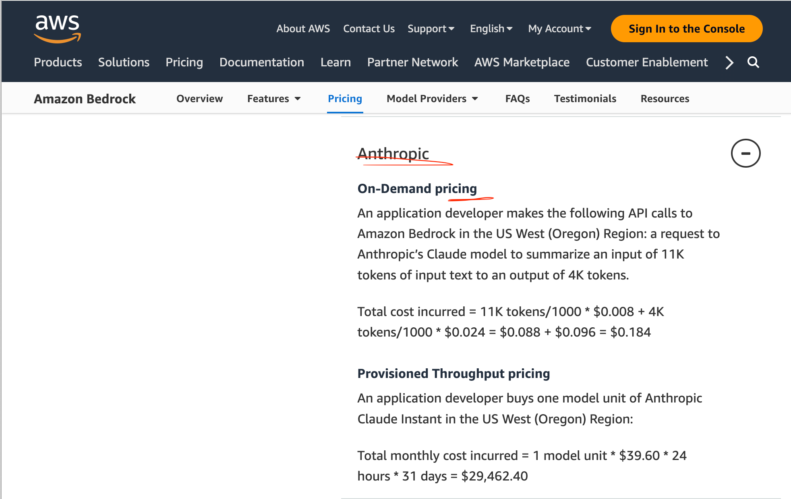
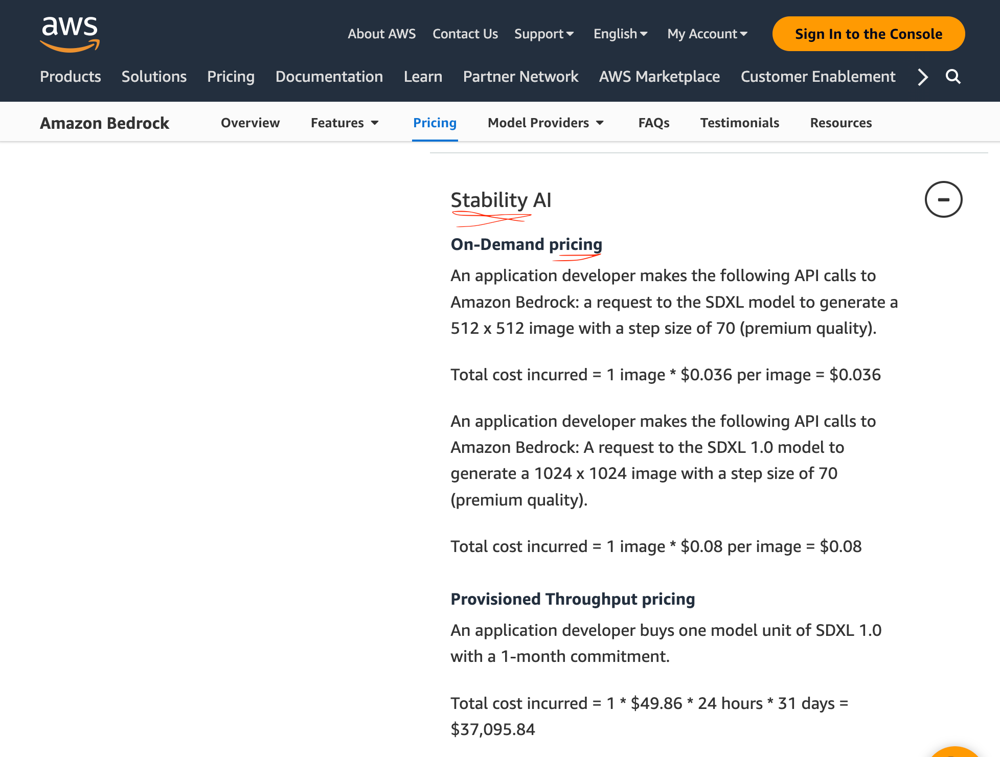
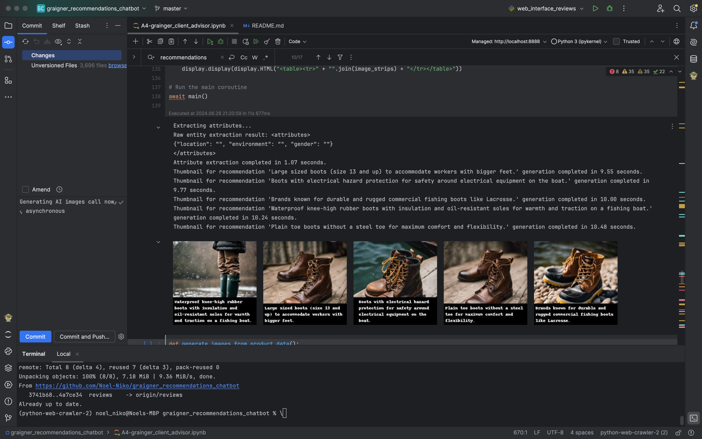

# grainger_recommendations_chatbot

## Key Features: 
  - Asynchronous calls and use of a polling for "reviews" to return a responses as soon as available.
  - Utilizes Anthropic instead of OpenAi, and through its use of AWS Bedrock Anthropic can be switched for any of the many LLM models available.
  - Uses Named Entity Recognition to categorize the customer and personalize responses.
    - This could also be used for generating analytic data on customers.
    
     

# Data Sources:
  - Webscrapes grainger.com for a potential list of related products.
  - Calls internal Grainger Api for product details and compiles data frame.
  - Webscrapes sister company Zoro for the review data, which Grainger.com does not provide
  - Calls Grainger.com directly to obtain product images
  
  - TODO: Address ordering capability.
      -   Provide an interface to add customer order history for later implementation within the Grainger VPC.
      -   Possibly orchestrate user login initially and thereby call order history and allow recommendations (e.g. clothing sizes) specific to the customer based on past orders.
      -   Implement an in-mobile-phone chat that uses the stored SQL database of past orders (currently for off-line searching by customer).

# Depth First Web Scrape to Obtain List of Related Products

# Call to Obtain Product Details on All Valid Product Codes Collected

# Generate Data Frame

# Enable Live-Calls to Obtain the Latest Product Recommendations from Zoro

# AWS Bedrock
- LLM used: Anthropic
    
  
- AI Image Generator 
    

- For comparison: 
  - https://aws.amazon.com/bedrock/pricing/
  - https://openai.com/api/pricing/
 
Note: incorporates ideas from https://github.com/aws-samples/amazon-bedrock-aistylist-lab/blob/main/README.md

## AI Image Generation:
- Though removed from the final product as superfluous, images can be generated of the products being used in the environment and by the type of user obtained from the gleaned customer attributes.

## Running Locally:
- brew install --cask firefox
- sudo ln -s /Applications/Firefox.app/Contents/MacOS/firefox /usr/local/bin/firefox
- brew install geckodriver
- set up your conda environment
- pip install -r requirements.txt
